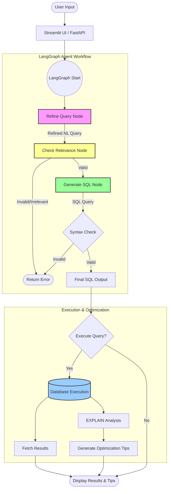

# Agentic AI SQL Generator - Workflow Diagram

## Workflow Steps

1.  **User Input**: The user provides a natural language request (e.g., "Show top 3 customers").
2.  **Refine Query Node**: The agent rephrases the input into precise technical language (e.g., "delete database" -> "DROP DATABASE").
3.  **Check Relevance Node**: A strict validator checks if the requested tables/columns actually exist in the schema.
4.  **Generate SQL Node**: An expert LLM converts the refined request into optimized SQL (handling complex logic like CTEs and Window Functions).
5.  **Execution**: If approved, the query is executed against the connected database.
6.  **Optimization**: The system runs an `EXPLAIN` plan to provide performance tips (e.g., "Add index on column X").
